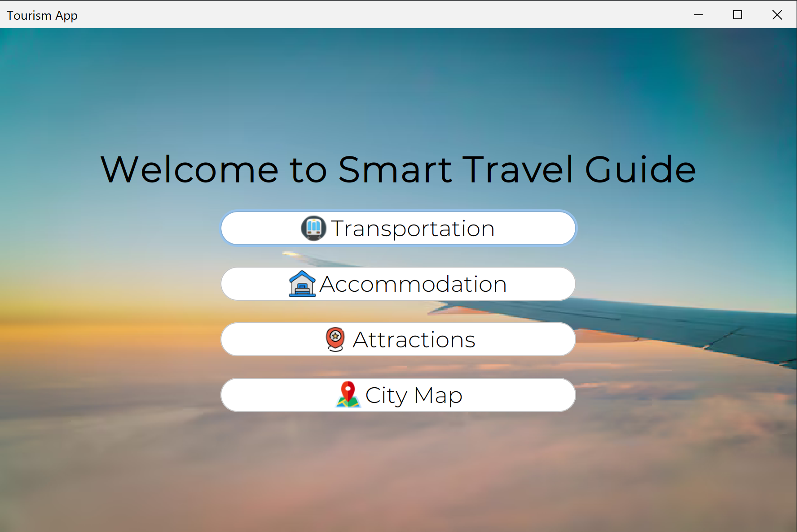
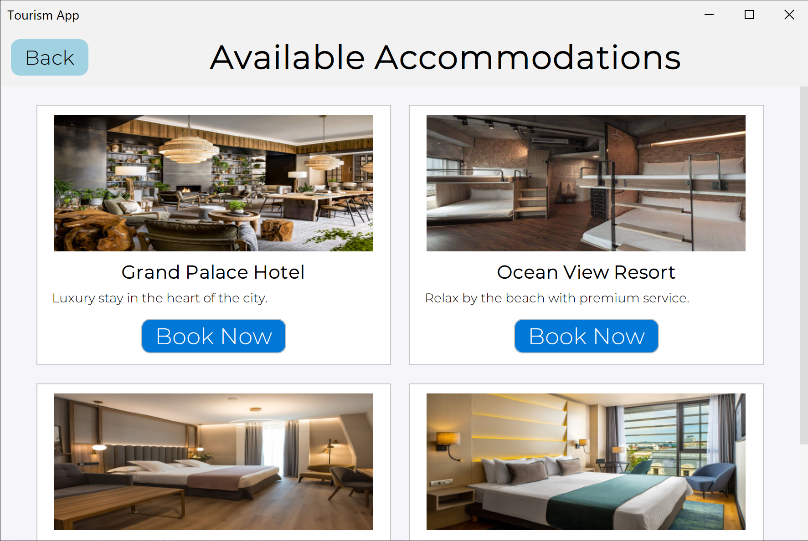
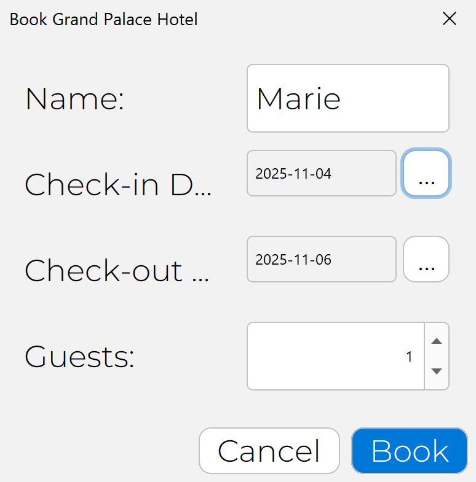
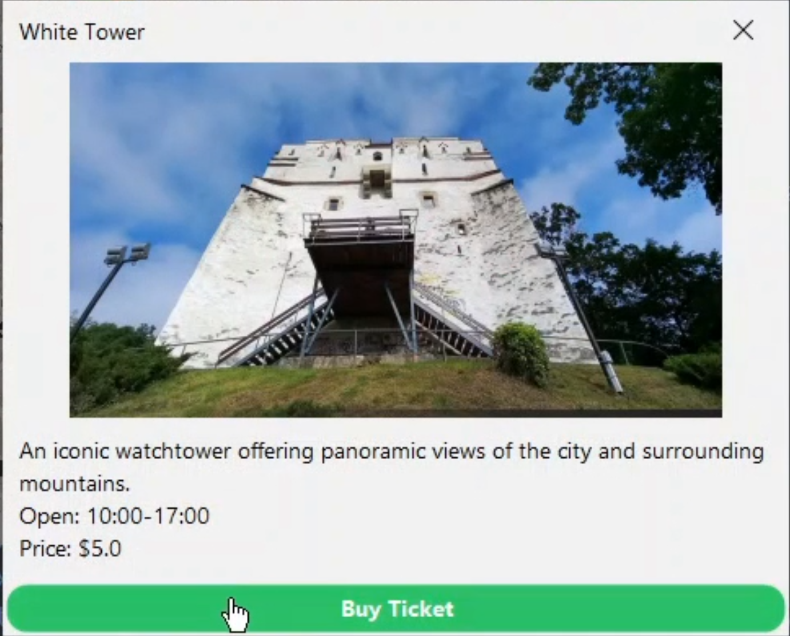
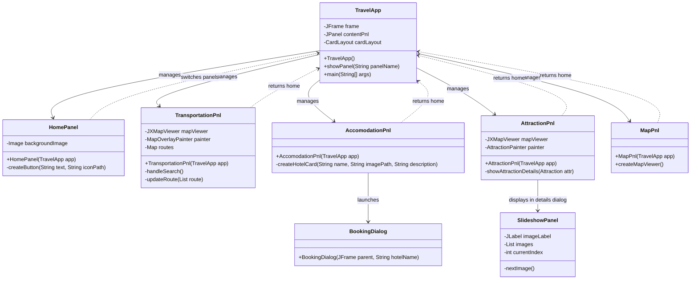
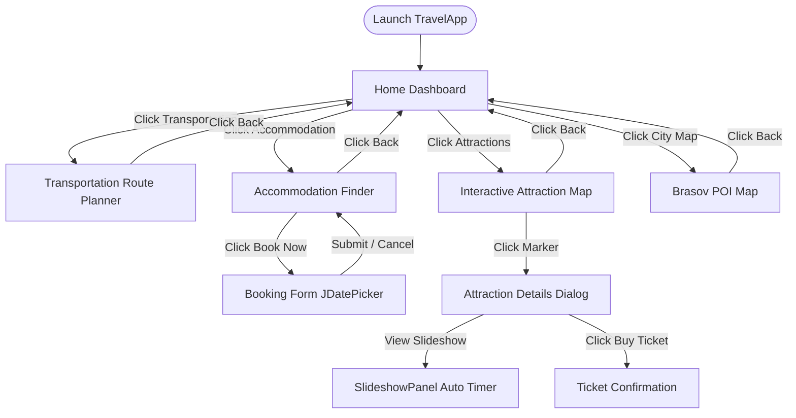

# Travel App

An interactive, modern **Java Swing-based desktop application** designed to help users plan transit routes, search for accommodation, and discover popular travel attractions in **Romania** (specifically focused around Brasov). Powered by a custom OpenStreetMap rendering engine, modern typography, and a polished flat-themed GUI.

---

## Key Features

-   **Interactive City Map Explorer** (`MapPnl.java`): Centered in Brasov, Romania. Renders critical points of interest (Airport, Train Station, Museum) and connects them dynamically with route path lines.
-   **Multi-City Route Planner** (`TransportationPnl.java`): Renders transit connections between major Romanian hubs (Brasov, Cluj-Napoca, Bucharest, Sibiu). Supports dynamic route paths depending on the transport mode chosen (Plane, Train, Bus).
-   **Hotel Browser & Booking Dialog** (`AccomodationPnl.java`): Lists popular lodging destinations in a grid-like view. Clicking "Book Now" launches a specialized date-picker modal dialog (`BookingDialog.java`) with field validation.
-  **Popular Sights Guide** (`AttractionPnl.java`): Explores historic landmarks (e.g., Bran Castle, Black Church, White Tower) with interactive markers. Selecting a landmark pops up an detail view featuring:
    *   An auto-advancing **image slideshow** (`SlideshowPanel`) powered by an internal Swing Timer.
    *   Attraction description, ticket prices, and opening hours.
    *   Online ticket purchase integration.
-   **UI styling**: Powered by the FlatLaf theme, custom rounded buttons, customized hover micro-animations, and Montserrat / Roboto typography.

---

## Technologies 

[](https://www.oracle.com/java/)
[](https://github.com/DevChute/FlatLaf)
[](https://github.com/msteiger/jxmapviewer2)

- **Java Swing and Flatlaf** – UI components
- **JXMapViewer2** – Map rendering and interaction
- **Maven**  – Dependency management
- **Java 8+**

---

## Visual Gallery

| Home Dashboard | Route Planner (Train/Bus/Plane) |
|:---:|:---:|
|  |  |
| *Welcome screen with customized navigation options and Montserrat typography.* | *Interactive map routes, terminal location pins, and search parameters.* |

| Accommodation Finder | Attraction Sights Guide |
|:---:|:---:|
|  |  |
| *Browse handpicked stays with description cards and booking CTAs.* | *Explore points of interest on the interactive map with custom markers.* |

| Booking Calendar Modal | Ticket Purchase Slideshow |
|:---:|:---:|
|  |  |
| *Date-picking modal calendar powered by JDatePicker.* | *Rotating image slideshow panel and instant ticket checkout.* |

##  Architecture & Component Flow

The application implements a clean **Mediator & CardLayout Architecture**, where [TravelApp.java](TouristGuide/src/TravelApp.java) acts as the central coordinator swapping sub-panels dynamically.

###  Class Diagram



### Navigation Flow



---

## Project Structure

```directory
TouristGuide/
├── .vscode/                 # VS Code-specific configurations and classpaths
├── bin/                     # Compiled JVM .class files output directory
├── lib/                     # External library archives (.jar dependencies)
└── src/                     # Java source files
    ├── Fonts/               # TrueType Font assets (Montserrat, Roboto)
    ├── Images/              # UI Icons, backgrounds, and landmark images
    ├── AccomodationPnl.java # Accommodation display panel
    ├── AttractionPnl.java   # Map panel showing landmarks & details dialog
    ├── BookingDialog.java   # Booking form using date pickers
    ├── HomePanel.java       # Main entry dashboard view
    ├── MapPnl.java          # Basic city map with route vectors
    ├── TransportationControls.java # Panel controls for input search
    ├── TransportationPnl.java # Main route planner interface
    └── TravelApp.java       # Central coordinator & Application main entry
```

---

## Dependencies

All required JAR libraries are preloaded in the `TouristGuide/lib/` folder:

| Library | Version | Description |
|:---|:---:|:---|
| **FlatLaf** | `3.2` | Flat Look & Feel library providing standard modern designs. |
| **FlatLaf Extras** | `3.6` | Auxiliary styling utilities for custom Swing components. |
| **JXMapViewer2** | `2.8` | OpenStreetMap layout visualizer for rendering interactive tile maps. |
| **JDatePicker** | `1.3.4` | Interactive Calendar Date Picker component used for bookings. |
| **JCalendar** | `1.4` | Helper calendar date picker suite. |
| **JGoodies Common** | `1.2.0` | Helper foundation for JGoodies Swing UI components. |
| **JGoodies Looks** | `2.4.1` | Swing Look & Feel rendering extensions. |
| **Commons Logging** | `1.3.5` | Logging interface utilized by visual libraries. |
| **JUnit** | `4.6` | Unit testing utility suite. |

---

## Installation & Setup

### Prerequisites
*   **Java SE Development Kit (JDK)**: Version 8 or newer installed on your machine.
*   **Visual Studio Code** (with the *Extension Pack for Java*) **OR** any standard IDE (IntelliJ IDEA, Eclipse).

---

### Run in Visual Studio Code (Recommended)
1.  Clone the repository and open the workspace root folder in VS Code.
2.  VS Code will automatically detect the java project structure using configurations inside `.vscode/settings.json`.
3.  Ensure the libraries inside `TouristGuide/lib/` are fully referenced by checking the **Java Projects** view sidebar.
4.  Navigate to [TravelApp.java](TouristGuide/src/TravelApp.java), locate the `main` method, and click **Run** or press `F5` to compile and launch.

---

### Run from Command Line Interface (CLI)

Since the resources (Fonts, Images) are embedded within the `src` directory, you must include `src` in your classpath when executing to ensure images and fonts load properly.

#### 1. Navigate to the project directory:
```bash
cd TouristGuide
```

#### 2. Create compile destination folder:
```bash
mkdir bin
```

#### 3. Compile the Java files:
*   **Windows (Command Prompt / PowerShell)**:
    ```cmd
    javac -d bin -cp "lib/*" src/*.java
    ```
*   **Linux / macOS**:
    ```bash
    javac -d bin -cp "lib/*" src/*.java
    ```

#### 4. Run the application:
*   **Windows (Command Prompt / PowerShell)**:
    ```cmd
    java -cp "bin;src;lib/*" TravelApp
    ```
*   **Linux / macOS**:
    ```bash
    java -cp "bin:src:lib/*" TravelApp
    ```

---

## Cross-Platform Compatibility Notice

> [!WARNING]
> The source code references assets dynamically (e.g. `"images/marker-icon.png"` vs. `"Images/Metro.png"`).
> *   On **Windows**, filenames and paths are case-insensitive.
> *   On **Linux & macOS**, the filesystem is strictly case-sensitive. If you experience resource load failures, ensure the filesystem directory name matches the source paths (`Images` folder vs. `images/` loader string).

---
## License & Attributions

*   This project is licensed under the MIT License.
*   Maps rendering powered by [OpenStreetMap](https://www.openstreetmap.org/) contributors under ODbL, via JXMapViewer2.
*   Theme styling utilizes [FormDev FlatLaf](https://www.formdev.com/flatlaf/).


